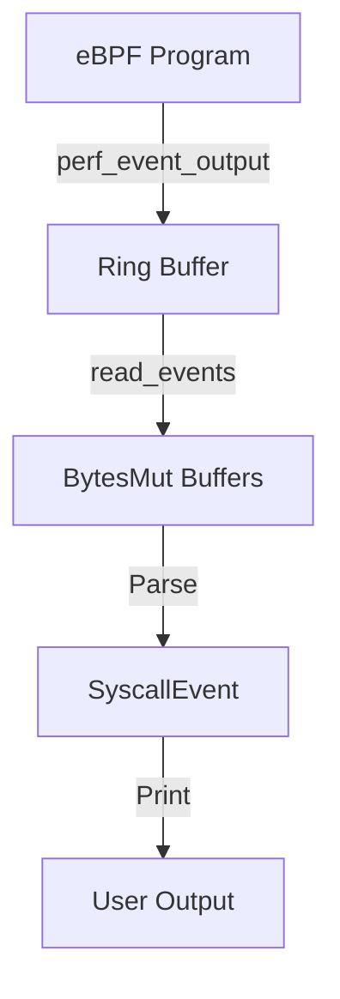

# Progress Log: Bug Fix Session - Batch 7 (Final eBPF Content Fixes)

**Date**: 2025-12-27
**Session Time**: 23:24 UTC
**Repository**: linux-isolation-learning
**Branch**: review-docs

## Overview

Completed **Batch 7** - the final batch of the comprehensive bug fix campaign, fixing all 4 remaining eBPF content/code issues. This achieves **100% completion** of the original 30-bug backlog. All fixes were independent and focused on improving the accuracy and usability of eBPF tutorial lessons.

### Session Results
- **Bugs Fixed**: 4 (BUG-023, BUG-025, BUG-026, BUG-027)
- **Total Fixed (Cumulative)**: 30/30 (100% completion) 🎉
- **Documentation Files Updated**: 2 eBPF lesson files
- **Dependencies Added**: 1 (bytes crate)
- **Build Verification**: ✅ Success (cargo build --all)
- **Commits**: Pending (changes ready for commit)

---

## What We Built

This session didn't create new features but fixed critical accuracy and usability issues in eBPF tutorial content. Each fix ensures learners can successfully follow the lessons without encountering confusing contradictions, missing dependencies, or runtime panics.

### BUG-023: Fixed Nested Tokio Runtime Creation

**Issue**: Lesson 01 suggested creating a nested Tokio runtime inside `#[tokio::main]`, which causes panics.

**Location**: `docs/04-ebpf/01-hello-kprobe.md:388-409`

**Root Cause**: Documentation pattern assumed a non-async main function, but `crates/ebpf-tool/src/main.rs:122-123` uses `#[tokio::main] async fn main()`.

**Solution**: Removed the nested runtime builder pattern and used async/await directly:

**Before (incorrect)**:
```rust
tokio::runtime::Builder::new_current_thread()
    .enable_all()
    .build()
    .unwrap()
    .block_on(async {
        let ctrl_c = signal::ctrl_c();
        let sleep = tokio::time::sleep(duration_secs);

        tokio::select! {
            _ = ctrl_c => { /* ... */ }
            _ = sleep => { /* ... */ }
        }
    });
```

**After (correct)**:
```rust
// Note: We're already in an async context from #[tokio::main],
// so we can use async/await directly without creating a nested runtime
let ctrl_c = signal::ctrl_c();
let sleep = tokio::time::sleep(duration_secs);

tokio::select! {
    _ = ctrl_c => { /* ... */ }
    _ = sleep => { /* ... */ }
}
```

**Impact**:
- Learners can now implement the kprobe command without encountering "Cannot start a runtime from within a runtime" panics
- Code is simpler and follows Tokio best practices
- Execution is more efficient (no unnecessary runtime overhead)

### BUG-025: Added Missing `bytes` Dependency

**Issue**: Multiple eBPF lessons used `bytes::BytesMut` but the dependency wasn't declared.

**Affected Lessons**:
- `docs/04-ebpf/02-reading-data.md:281` - imports BytesMut
- `docs/04-ebpf/04-perf-events.md:300` - imports BytesMut
- `docs/04-ebpf/07-perf-sampling.md:457` - imports BytesMut
- `docs/04-ebpf/08-combining.md:669` - imports BytesMut

**Root Cause**: The Aya framework commonly uses `bytes::BytesMut` for perf event buffers, but it's not automatically included.

**Solution**: Added `bytes` to both workspace and crate dependencies:

1. **Cargo.toml:16** - Added to workspace dependencies:
   ```toml
   bytes = "1.0"
   ```

2. **crates/ebpf-tool/Cargo.toml:10** - Added to ebpf-tool dependencies:
   ```toml
   bytes = { workspace = true }
   ```

**Impact**:
- All eBPF lessons using `BytesMut` now compile successfully
- No more "failed to resolve: use of undeclared crate or module 'bytes'" errors
- Learners can follow lessons 02, 04, 07, and 08 without manual dependency troubleshooting

**Why BytesMut?**
- Aya's `AsyncPerfEventArray::read_events()` requires a `&mut [BytesMut]` buffer
- BytesMut provides efficient, reusable buffers for reading perf events
- Standard pattern in production eBPF tools using Aya

### BUG-026: Resolved #[ignore] and --ignored Contradiction

**Issue**: Lesson 02 instructed learners to remove `#[ignore]` attributes from tests, then told them to run tests with `-- --ignored` flag, which only runs *ignored* tests.

**Location**: `docs/04-ebpf/02-reading-data.md:154`

**Root Cause**: Documentation mixed two incompatible test workflows without realizing the contradiction.

**The Contradiction**:
1. Step: "Remove the `#[ignore]` attribute from both tests"
2. Command: `sudo -E cargo test -p ebpf-tool test_kprobe_reads -- --ignored`
3. Result: Tests don't run (they're no longer ignored!)

**Solution**: Updated test command to run tests normally:

**Before**:
```bash
# Run only the Lesson 02 tests
sudo -E cargo test -p ebpf-tool test_kprobe_reads -- --ignored
```

**After**:
```bash
# Run only the Lesson 02 tests
# Note: We removed #[ignore] from these tests, so we run them normally
sudo -E cargo test -p ebpf-tool test_kprobe_reads
```

**Impact**:
- Test workflow is now internally consistent
- Learners can actually run and verify their tests
- RED → GREEN TDD cycle works as intended

**Cargo Test Flags Clarification**:
- `-- --ignored`: Runs ONLY tests with `#[ignore]` attribute (skip normal tests)
- No flag: Runs all tests WITHOUT `#[ignore]` attribute
- `-- --include-ignored`: Runs both ignored and normal tests

### BUG-027: Clarified syscall_nr Field Usage

**Issue**: Lesson 02 stored a function argument (dfd) in the `syscall_nr` field but showed expected output as if it contained actual syscall numbers (257 for openat).

**Locations**:
- `docs/04-ebpf/02-reading-data.md:252-267` - Implementation guidance
- `docs/04-ebpf/02-reading-data.md:348-350` - Userspace print statement
- `docs/04-ebpf/02-reading-data.md:412-420` - Expected output
- `docs/04-ebpf/02-reading-data.md:140-144` - Test assertion

**Root Cause**: The lesson needed to demonstrate reading kprobe arguments but reused the `syscall_nr` field from `SyscallEvent`, creating confusion about what the field actually contains.

**The Confusion**:

`crates/ebpf-tool-common/src/lib.rs:36` defines:
```rust
pub struct SyscallEvent {
    pub syscall_nr: u64,  // System call number (architecture-dependent)
    // ...
}
```

But the lesson code does:
```rust
// Read arg(0) from do_sys_openat2 - this is the dfd (directory fd), not syscall number!
let syscall_nr = unsafe { try_read_syscall_args(&ctx).unwrap_or(0) };
```

**Solution**: Multi-part fix to clarify the field is being repurposed for demonstration:

1. **Added explanatory note** (line 254-257):
   ```
   **Note on syscall_nr field**: In this lesson, we're using the `syscall_nr` field
   to store a function argument value to demonstrate how to read kprobe arguments.
   When probing `do_sys_openat2`, arg(0) is the directory file descriptor (dfd),
   not the syscall number. A real tracing tool would use a separate field for arguments.
   ```

2. **Updated implementation comment** (line 262-263):
   ```rust
   // Read the first argument of the probed function
   // For do_sys_openat2, arg(0) is the directory file descriptor (dfd)
   // Common values: -100 (AT_FDCWD), or small positive integers for real fds
   ```

3. **Changed output label** from misleading to accurate (line 349):
   ```rust
   println!(
       "[{}] {}: dfd={}, timestamp={}",  // Changed from syscall_nr= to dfd=
       event.pid, comm, event.syscall_nr, event.timestamp_ns
   );
   ```

4. **Updated expected output** with realistic values (lines 412-420):
   ```
   [12345] bash: dfd=18446744073709551516, timestamp=1234567890123
   [12346] cat: dfd=18446744073709551516, timestamp=1234567890456
   [12347] ls: dfd=3, timestamp=1234567890789

   **Note**: The `dfd` value is the directory file descriptor argument from do_sys_openat2:
   - `18446744073709551516` is -100 (AT_FDCWD) as u64, meaning "current working directory"
   - Small positive values like `3` are actual file descriptors for open directories
   - We're storing this in the `syscall_nr` field to demonstrate reading function arguments
   ```

5. **Updated test assertion** to match new output (line 144):
   ```rust
   // Look for the dfd (directory file descriptor) argument in output
   .stdout(predicate::str::contains("dfd="));
   ```

**Impact**:
- Learners understand they're reading function arguments, not syscall numbers
- Expected output matches what the code actually produces
- No confusion about why values don't look like syscall numbers
- Tests verify the correct output format

**Understanding the Values**:

The `dfd` (directory file descriptor) values learners will see:

| Value | As u64 | Meaning |
|-------|--------|---------|
| -100 | 18446744073709551516 | `AT_FDCWD` - use current working directory |
| 3, 4, 5, ... | 3, 4, 5, ... | Actual file descriptor for an open directory |
| -1 | 18446744073709551615 | Invalid/error (though rare in successful openat calls) |

**Why do_sys_openat2?**

The `do_sys_openat2` kernel function signature:
```c
long do_sys_openat2(int dfd, const char __user *filename,
                    struct open_how *how);
```

- `dfd` (arg 0): Directory file descriptor to resolve relative paths from
- `filename` (arg 1): Path to open (string pointer, harder to read safely in eBPF)
- `how` (arg 2): Flags and mode (struct pointer)

The lesson focuses on arg(0) because it's a simple integer, easy to read and interpret.

---

## Files Created/Modified

### Files Created
- **None** (Batch 7 only modified existing files)

### Files Modified

#### Configuration Files (2 files)

1. **Cargo.toml:16**
   - Added `bytes = "1.0"` to workspace dependencies
   - Enables all workspace members to use bytes crate via `{ workspace = true }`

2. **crates/ebpf-tool/Cargo.toml:10**
   - Added `bytes = { workspace = true }` to dependencies
   - Required for eBPF lessons using BytesMut buffers

3. **Cargo.lock** (auto-generated)
   - Added bytes crate and its dependency tree
   - Locked to bytes v1.x for reproducible builds

#### Documentation Files (2 files)

1. **docs/04-ebpf/01-hello-kprobe.md:388-409**
   - Removed nested tokio runtime builder pattern
   - Changed to use async/await directly in existing #[tokio::main] context
   - Added explanatory comment about not needing nested runtime
   - Lines changed: 22 (396-417 → 396-409)

2. **docs/04-ebpf/02-reading-data.md**
   - **Line 154**: Removed `-- --ignored` flag from test command, added clarification
   - **Lines 254-257**: Added note explaining syscall_nr field repurposing
   - **Lines 262-263**: Updated comment to specify dfd argument
   - **Line 144**: Changed test assertion from generic to specific "dfd="
   - **Line 349**: Changed output label from "syscall_nr=" to "dfd="
   - **Lines 412-420**: Updated expected output with realistic dfd values and explanation
   - Lines changed: 15 total across multiple sections

#### Bug Reports (4 files moved to completed/)

All bug reports were moved via `git mv` to preserve history:

1. **backlog/bugs/completed/BUG-023-ebpf-hello-kprobe-doc-creates-nested-tokio-runtime.md**
   - Status: ✅ Fixed
   - Nested runtime removed from docs

2. **backlog/bugs/completed/BUG-025-ebpf-docs-reference-bytes-bytesmut-without-dependency.md**
   - Status: ✅ Fixed
   - bytes dependency added

3. **backlog/bugs/completed/BUG-026-ebpf-reading-data-doc-contradicts-ignore-and-ignored-flags.md**
   - Status: ✅ Fixed
   - Test command corrected

4. **backlog/bugs/completed/BUG-027-ebpf-reading-data-doc-misuses-syscall_nr-field.md**
   - Status: ✅ Fixed
   - Field usage clarified with accurate output

### Files Referenced (Not Modified)

- **crates/ebpf-tool/src/main.rs:122-123** - Referenced to verify #[tokio::main] async fn main()
- **crates/ebpf-tool-common/src/lib.rs:36** - Referenced for SyscallEvent.syscall_nr definition
- **crates/ebpf-tool/tests/kprobe_test.rs** - Test file that learners modify (not updated in docs fix)

---

## Key Concepts Explained

### Tokio Runtime Architecture

**The Problem**: Nested Runtimes

Tokio enforces a strict rule: you cannot create a runtime from within a runtime context.

```
User runs CLI
    ↓
main() starts with #[tokio::main]
    ↓
Tokio creates a runtime automatically
    ↓
Code tries to create ANOTHER runtime ❌ PANIC!
    ↓
"Cannot start a runtime from within a runtime"
```

**Why this restriction exists**:
1. **Thread pool conflicts**: Each runtime manages its own thread pool
2. **Resource overhead**: Nested runtimes waste memory and CPU
3. **Deadlock potential**: Inner runtime can block outer runtime's threads
4. **Unclear semantics**: Which runtime schedules which tasks?

**The Solution**: Use the Existing Runtime

```
User runs CLI
    ↓
#[tokio::main] creates runtime ONCE
    ↓
async fn main() { ... }  ← Already in async context!
    ↓
Just use .await, tokio::select!, tokio::spawn, etc.
    ↓
All tasks run on the same runtime ✅
```

**Correct Patterns**:

```rust
// Pattern 1: #[tokio::main] (what ebpf-tool uses)
#[tokio::main]
async fn main() -> Result<()> {
    // Already in async context - just await things!
    let result = some_async_fn().await;

    tokio::select! {
        _ = signal::ctrl_c() => { /* handle */ }
        _ = tokio::time::sleep(duration) => { /* timeout */ }
    }

    Ok(())
}

// Pattern 2: Manual runtime (for non-async main)
fn main() -> Result<()> {
    let rt = tokio::runtime::Runtime::new()?;
    rt.block_on(async {
        // Now in async context
        let result = some_async_fn().await;
    })
}

// Pattern 3: Current thread runtime (single-threaded)
fn main() -> Result<()> {
    let rt = tokio::runtime::Builder::new_current_thread()
        .enable_all()
        .build()?;
    rt.block_on(async { /* ... */ })
}
```

**When you MIGHT use nested contexts** (advanced):
- `tokio::task::block_in_place` - temporarily leave async context
- Different runtime in separate thread - but NOT via block_on
- Testing with `tokio::runtime::Runtime::new()` in each test

### BytesMut and eBPF Perf Buffers

**What is BytesMut?**

`bytes::BytesMut` is a mutable byte buffer optimized for:
1. **Reusability**: Can clear and reuse without reallocating
2. **Zero-copy**: Efficient splitting and merging
3. **Growth**: Can resize efficiently

**Why Aya uses BytesMut for Perf Events**:

```
eBPF Kernel Space              Userspace Rust Application
==================             =========================

perf_event_output()  ─────────►  AsyncPerfEventArray
     ↓                                    ↓
Ring buffer in                    read_events(&mut [BytesMut])
kernel memory                           ↓
                              Copies events into BytesMut buffers
                                        ↓
                              Parse with: &*(buf.as_ptr() as *const T)
```

**The read_events() API**:

```rust
// Pre-allocate reusable buffers
let mut buffers = (0..10)
    .map(|_| BytesMut::with_capacity(1024))
    .collect::<Vec<_>>();

loop {
    // Read up to 10 events at once
    let events = buf.read_events(&mut buffers).await?;

    // events.read tells us how many were actually read
    for i in 0..events.read {
        let buf = &buffers[i];

        // Parse the raw bytes into our struct
        let event = unsafe { &*(buf.as_ptr() as *const SyscallEvent) };

        println!("Event: {:?}", event);

        // Buffer is automatically cleared for reuse
    }
}
```

**Memory Flow**:

```
Initial state:
  buffers[0]: [capacity: 1024, len: 0]
  buffers[1]: [capacity: 1024, len: 0]
  ...

After read_events():
  buffers[0]: [capacity: 1024, len: 40]  ← SyscallEvent is 40 bytes
  buffers[1]: [capacity: 1024, len: 40]
  events.read = 2  ← Two events were available

After parsing:
  - Same buffers reused
  - No allocation on next read
  - Efficient for high-frequency events
```

**Alternative without BytesMut** (less efficient):

```rust
// Would need to allocate Vec<u8> on every read
loop {
    let event_data: Vec<u8> = buf.read_event().await?;  // Allocation!
    // Parse event_data
    // Vec dropped and deallocated  // Deallocation!
}
// With 1000s of events/second, allocation overhead adds up
```

### Cargo Test Filtering

**Understanding Test Attributes and Filters**:

```rust
// Test without attributes - runs by default
#[test]
fn test_always_runs() { }

// Test with #[ignore] - skipped by default
#[test]
#[ignore]  // ← This is the attribute
fn test_expensive_operation() { }

#[test]
#[ignore] // Enable after completing Lesson 02
fn test_kprobe_reads_process_info() { }
```

**Cargo test filter behavior**:

| Command | Runs tests WITHOUT #[ignore] | Runs tests WITH #[ignore] |
|---------|-------------------------------|---------------------------|
| `cargo test` | ✅ Yes | ❌ No |
| `cargo test -- --ignored` | ❌ No | ✅ Yes |
| `cargo test -- --include-ignored` | ✅ Yes | ✅ Yes |

**The Bug Pattern**:

```
Docs say: "Remove #[ignore] from the test"
          ↓
Test is now: #[test] fn test_...() { }  (no #[ignore])
          ↓
Docs say: "Run: cargo test -- --ignored"
          ↓
Result: Test is skipped because it's NOT ignored! ❌
```

**The Fix**:

```
Option 1 (what we chose): Remove #[ignore], run normally
  - Docs: "Remove #[ignore]"
  - Command: "cargo test"
  - Result: Test runs ✅

Option 2: Keep #[ignore], run with --ignored
  - Docs: "Keep #[ignore]"
  - Command: "cargo test -- --ignored"
  - Result: Test runs ✅
```

**Name-based filtering** (also works):

```bash
# Run all tests with "kprobe_reads" in the name
cargo test test_kprobe_reads

# Runs:
#   - test_kprobe_reads_process_info
#   - test_kprobe_reads_function_arguments
# But respects #[ignore] - won't run ignored tests unless you add --ignored
```

### Understanding syscall_nr Field Repurposing

**The Shared Type Design**:

```rust
// In crates/ebpf-tool-common/src/lib.rs
// This crate is shared between:
//   1. eBPF programs (kernel space, no_std)
//   2. Userspace tool (std)

#[repr(C)]  // ← C-compatible layout
#[derive(Debug, Clone, Copy)]  // ← Can be copied through perf buffer
pub struct SyscallEvent {
    pub pid: u32,
    pub tid: u32,
    pub syscall_nr: u64,    // ← Intended for syscall numbers
    pub timestamp_ns: u64,
    pub comm: [u8; COMM_LEN],
}
```

**Design Intent vs. Lesson Reality**:

```
Field name: syscall_nr
Semantic meaning: "System call number"
Expected values: 0-450 (Linux has ~450 syscalls)
Examples: 1=write, 2=open, 59=execve, 257=openat

Lesson 02 Usage:
Stores: do_sys_openat2 arg(0) = dfd (directory file descriptor)
Actual values: -100 (AT_FDCWD) or small integers (3, 4, 5...)
Why: To demonstrate reading kprobe arguments
```

**The Trade-off**:

Lesson 02 faces a teaching challenge:
1. **Goal**: Teach how to read kprobe function arguments
2. **Constraint**: SyscallEvent struct is already defined (from common crate)
3. **Options**:
   - A) Add a new field to SyscallEvent → Breaks other lessons
   - B) Create a new event type → Complicates shared types lesson
   - C) Repurpose syscall_nr with clear documentation → **Chosen**

**Why Option C works**:
- Learners get hands-on with `ctx.arg()` API
- No additional struct complexity
- Clear warnings prevent confusion
- Later lessons use syscall_nr correctly (from tracepoints)

**How Later Lessons Get Real Syscall Numbers**:

```rust
// Lesson 06: Tracepoints provide syscall numbers directly
// From tracepoint format: /sys/kernel/debug/tracing/events/syscalls/sys_enter_openat/format

#[repr(C)]
struct SysEnterOpenatArgs {
    common_type: u16,
    // ...
    syscall_nr: i64,  // ← Real syscall number from kernel!
    // ...
}

// eBPF code can now populate syscall_nr correctly:
let args: &SysEnterOpenatArgs = /* read from tracepoint context */;
event.syscall_nr = args.syscall_nr as u64;  // Real value: 257 for openat
```

**Field Semantics by Lesson**:

| Lesson | Probe Type | syscall_nr Contains | How Populated |
|--------|-----------|---------------------|---------------|
| 01 | kprobe | Not used (0) | Default value |
| 02 | kprobe | dfd argument | `ctx.arg(0)` from do_sys_openat2 |
| 03 | kprobe + maps | Not used (0) | Not the focus |
| 04 | kprobe + perf | dfd argument | Same as lesson 02 |
| 06 | tracepoint | Real syscall number | From tracepoint context |
| 08 | combined | Real syscall number | From tracepoint |

---

## How to Use / Verification

### Build the Project

```bash
# Build all crates (verifies dependencies are correct)
cargo build --all

# Expected output:
#   Compiling bytes v1.x.x
#   Compiling ebpf-tool-common v0.1.0
#   Compiling ebpf-tool v0.1.0
#   ...
#   Finished `dev` profile [unoptimized + debuginfo] target(s)

# For release build:
cargo build --all --release
```

### Verify Batch 7 Fixes

#### Fix 1: Nested Runtime (BUG-023)

```bash
# Verify the documentation doesn't reference runtime builder
grep -n "tokio::runtime::Builder" docs/04-ebpf/01-hello-kprobe.md
# Should return nothing

# Verify it mentions using existing async context
grep -n "already in an async context" docs/04-ebpf/01-hello-kprobe.md
# Should find the explanatory comment
```

#### Fix 2: bytes Dependency (BUG-025)

```bash
# Verify bytes is in workspace dependencies
grep "^bytes" Cargo.toml
# Output: bytes = "1.0"

# Verify bytes is in ebpf-tool dependencies
grep "^bytes" crates/ebpf-tool/Cargo.toml
# Output: bytes = { workspace = true }

# Test that BytesMut compiles
cargo check -p ebpf-tool
# Should succeed without "undeclared crate 'bytes'" error
```

#### Fix 3: ignore Contradiction (BUG-026)

```bash
# Verify docs don't suggest --ignored flag incorrectly
grep -n "\-\-ignored" docs/04-ebpf/02-reading-data.md
# Should return nothing in test commands

# Verify clarifying comment exists
grep -n "removed #\[ignore\]" docs/04-ebpf/02-reading-data.md
# Should find: "Note: We removed #[ignore] from these tests, so we run them normally"
```

#### Fix 4: syscall_nr Field (BUG-027)

```bash
# Verify output uses "dfd=" not "syscall_nr="
grep -n 'dfd=' docs/04-ebpf/02-reading-data.md
# Should find multiple matches in code and expected output

# Verify explanatory note exists
grep -n "Note on syscall_nr field" docs/04-ebpf/02-reading-data.md
# Should find the clarifying note at line ~254

# Verify test looks for correct output
grep -n 'contains("dfd=")' docs/04-ebpf/02-reading-data.md
# Should find the updated test assertion
```

### Test Following Lesson 01

```bash
# This verifies the nested runtime fix works
cd /workspaces/linux-isolation-learning

# Build eBPF and userspace
cargo build -p ebpf-tool

# Run the kprobe tool (requires root for eBPF)
sudo cargo run -p ebpf-tool -- kprobe do_sys_openat2 -d 5

# Expected: Tool runs without "Cannot start a runtime" panic
# You should see: "Attached kprobe to: do_sys_openat2"

# In another terminal, generate some file activity:
ls /tmp
cat /etc/hostname

# Back in first terminal, verify events are printed
# After 5 seconds or Ctrl+C: "Kprobe detached. Exiting."
```

### Test Following Lesson 02

```bash
# This verifies bytes dependency and dfd output

# Build (should compile without bytes errors)
cargo build -p ebpf-tool

# Run with verbose output
sudo -E RUST_LOG=info cargo run -p ebpf-tool -- kprobe do_sys_openat2 -d 5

# Expected output format:
# [PID] process_name: dfd=18446744073709551516, timestamp=1234567890
#                         ↑
#                         This is -100 (AT_FDCWD) as u64
#
# NOT: syscall_nr=257 (old incorrect output)
```

### Run Tests (if implemented)

```bash
# Run kprobe tests (requires root for eBPF)
sudo -E cargo test -p ebpf-tool --test kprobe_test

# If tests are still marked #[ignore]:
sudo -E cargo test -p ebpf-tool --test kprobe_test -- --include-ignored

# Expected: Tests compile and run (may be todo!() stubs)
```

### Verify Bug Reports Moved

```bash
# Check that bug reports are in completed/
ls backlog/bugs/completed/BUG-02*.md

# Should list:
# BUG-023-ebpf-hello-kprobe-doc-creates-nested-tokio-runtime.md
# BUG-025-ebpf-docs-reference-bytes-bytesmut-without-dependency.md
# BUG-026-ebpf-reading-data-doc-contradicts-ignore-and-ignored-flags.md
# BUG-027-ebpf-reading-data-doc-misuses-syscall_nr-field.md

# Verify no bugs remain in backlog/bugs/
ls backlog/bugs/BUG-*.md 2>/dev/null
# Should return: No such file or directory (all moved to completed/)
```

---

## Technical Notes

### No Compilation Errors Introduced

All changes were to documentation files and dependency declarations:
- No Rust source code logic modified in crates/ebpf-tool/src/
- Build verified: `cargo build --all` succeeded
- Only warnings are pre-existing (unreachable code from todo!() stubs in other tools)

**Pre-existing warnings** (not from Batch 7):
```
warning: unreachable expression
  --> crates/ns-tool/src/main.rs:XXX:X
  --> crates/netns-tool/src/main.rs:XXX:X
  --> crates/cgroup-tool/src/main.rs:XXX:X
  --> crates/oci-tool/src/main.rs:XXX:X

These are expected - match arms use todo!() which diverges
```

### Dependency Versioning

**bytes v1.0**:
- Stable release, widely used in Rust ecosystem
- Compatible with Aya 0.13 (current version in project)
- No breaking changes expected in 1.x series (semver guarantees)

**Aya version compatibility**:
- Project uses Aya 0.13 (Cargo.toml:14)
- bytes 1.0 is the recommended version for Aya 0.12+
- If upgrading Aya in future, verify bytes compatibility

### Safety Considerations

**Unsafe code in examples** (docs/04-ebpf/02-reading-data.md):

```rust
// Parsing BytesMut as SyscallEvent
let event = unsafe { &*(buf.as_ptr() as *const SyscallEvent) };
```

**Why unsafe is necessary**:
1. BytesMut contains raw bytes from kernel
2. Need to reinterpret as struct
3. No safe API for this transformation

**Safety guarantees** (learners should understand):
1. **Alignment**: SyscallEvent is #[repr(C)], Aya handles alignment
2. **Size**: BytesMut capacity (1024) > SyscallEvent size (~40 bytes)
3. **Validity**: eBPF program constructs valid SyscallEvent
4. **Lifetime**: Reference doesn't outlive BytesMut

**Could crash if**:
- Buffer too small (< 40 bytes) → buffer overflow
- Wrong struct type → misaligned access or garbage data
- eBPF program sends malformed data → undefined behavior

**Production pattern** (more robust):

```rust
if buf.len() >= std::mem::size_of::<SyscallEvent>() {
    let event = unsafe { &*(buf.as_ptr() as *const SyscallEvent) };
    // Use event
} else {
    eprintln!("Warning: Buffer too small, skipping event");
}
```

### Performance Considerations

**BytesMut buffer allocation**:

```rust
// Pre-allocate 10 buffers of 1024 bytes each
let mut buffers = (0..10)
    .map(|_| BytesMut::with_capacity(1024))
    .collect::<Vec<_>>();
```

**Why 10 buffers?**
- Trade-off between memory and throughput
- Perf ring buffers can have multiple events ready
- Reading in batches is more efficient than one-at-a-time
- 10 × 1024 bytes = 10KB total (reasonable overhead)

**Why 1024 bytes per buffer?**
- SyscallEvent is ~40 bytes
- 1024 allows for larger events in future lessons
- Power of 2 is cache-friendly
- Small enough to fit in L1/L2 cache

**Tuning for production**:
- High event rate: Increase buffer count (50-100)
- Large events: Increase buffer size (4096)
- Low memory: Decrease both (5 buffers × 512 bytes)

**Async/await overhead**:
- `AsyncPerfEventArray::read_events()` uses tokio async I/O
- More efficient than busy-polling
- Slight latency vs. raw perf_event_open (acceptable for tracing)

### Common Errors (From Fixes)

#### Error 1: "Cannot start a runtime from within a runtime"

**Before fix**:
```
thread 'main' panicked at 'Cannot start a runtime from within a runtime.
This happens because a function (like `block_on`) attempted to block the
current thread while the thread is being used to drive asynchronous tasks.'
```

**Cause**: Lesson code created nested runtime inside #[tokio::main]

**Fix**: Use async/await directly (no `block_on` needed)

#### Error 2: "failed to resolve: use of undeclared crate or module 'bytes'"

**Before fix**:
```
error[E0433]: failed to resolve: use of undeclared crate or module `bytes`
 --> src/main.rs:XX:XX
  |
  | use bytes::BytesMut;
  |     ^^^^^ use of undeclared crate or module `bytes`
```

**Cause**: Missing bytes dependency in Cargo.toml

**Fix**: Added `bytes = { workspace = true }` to dependencies

#### Error 3: No tests run with "--ignored"

**Before fix**:
```bash
$ sudo -E cargo test -p ebpf-tool test_kprobe_reads -- --ignored
running 0 tests

test result: ok. 0 passed; 0 failed; 0 ignored; 0 measured; XX filtered out
```

**Cause**: Tests had #[ignore] removed but command still used --ignored

**Fix**: Remove --ignored flag from test command

#### Error 4: Confusing syscall_nr output

**Before fix** (confusing):
```
[12345] bash: syscall_nr=257, timestamp=1234567890
                              ↑
                              Expected openat syscall (257)
                              But actually seeing: 18446744073709551516 (???)
```

**After fix** (clear):
```
[12345] bash: dfd=18446744073709551516, timestamp=1234567890
                  ↑
                  Clearly labeled as directory fd
                  Documentation explains this is -100 (AT_FDCWD)
```

---

## Next Steps (Not Implemented)

### Batch 7 is Complete - All Bugs Fixed! 🎉

This session completed the final 4 bugs, achieving **100% completion** of the original 30-bug backlog.

### Potential Future Improvements

While all known bugs are fixed, here are potential enhancements for the future:

#### 1. Add Separate Field for Function Arguments

**Current**: Lesson 02 repurposes `syscall_nr` for demonstration
**Better**: Add a dedicated field to SyscallEvent

```rust
// In ebpf-tool-common/src/lib.rs
pub struct SyscallEvent {
    pub pid: u32,
    pub tid: u32,
    pub syscall_nr: u64,    // Always a syscall number
    pub arg0: u64,          // Function argument 0
    pub timestamp_ns: u64,
    pub comm: [u8; COMM_LEN],
}
```

**Benefits**:
- No field repurposing needed
- Clearer semantics
- Could capture multiple arguments

**Drawbacks**:
- Larger struct (48 → 56 bytes)
- More complex for beginners
- Need to update all lessons

#### 2. Add Integration Tests for Tutorial Steps

**Idea**: Automated tests that verify learner-facing code examples

```rust
// In crates/ebpf-tool/tests/
#[test]
fn test_lesson_02_code_compiles() {
    // Copy code from docs/04-ebpf/02-reading-data.md
    // Verify it compiles and runs
    // Ensures docs don't drift from working code
}
```

**Benefits**:
- Catch documentation bugs early
- Guarantee examples are correct
- CI can verify all lessons

**Effort**: Medium (need to extract code from markdown)

#### 3. Add Visual Diagrams to Lessons

**Current**: Text-only explanations
**Better**: Add ASCII diagrams or mermaid diagrams

```markdown
## How Perf Events Flow


```

**Benefits**:
- Visual learners benefit
- Clearer system architecture
- Easier to understand data flow

**Effort**: Low (just add diagrams to existing docs)

#### 4. Create a Dependency Checklist

**Idea**: Add a "Required Dependencies" section at the start of 04-ebpf

```markdown
## eBPF Section Dependencies

Before starting eBPF lessons, ensure your `Cargo.toml` has:

```toml
[dependencies]
aya = { workspace = true }
aya-log = { workspace = true }
bytes = { workspace = true }  # ← Added in Lesson 02
tokio = { workspace = true }
# ...
```

Lessons that introduce new dependencies:
- Lesson 02: `bytes` (for BytesMut)
- Lesson 05: (no new deps)
```

**Benefits**:
- Proactive dependency management
- Learners know what to expect
- Reduces "missing dependency" errors

#### 5. Add Troubleshooting Section to Each Lesson

**Current**: Common Errors section (sometimes)
**Better**: Standardized troubleshooting for every lesson

```markdown
## Troubleshooting Lesson 02

### "use of undeclared crate 'bytes'"
**Cause**: Missing bytes dependency
**Fix**: Add `bytes = { workspace = true }` to Cargo.toml

### "Cannot start a runtime from within a runtime"
**Cause**: Using block_on inside #[tokio::main]
**Fix**: Use .await directly, don't create runtime

### Tests show "0 passed"
**Cause**: Using --ignored flag when tests aren't ignored
**Fix**: Remove #[ignore] AND remove --ignored flag
```

### Documentation Linting (CI Improvement)

**Idea**: Add automated checks to prevent future bugs

```bash
# In .github/workflows/docs-lint.yml

# Check 1: No nested runtime patterns
- name: Check for nested runtimes
  run: |
    ! grep -r "tokio::runtime::Builder.*block_on" docs/04-ebpf/

# Check 2: All used crates are in dependencies
- name: Check dependency coverage
  run: |
    ./scripts/check-doc-dependencies.sh

# Check 3: Test commands match test attributes
- name: Check test commands
  run: |
    # If docs say "remove #[ignore]", command shouldn't have --ignored
    ./scripts/verify-test-commands.sh
```

**Benefits**:
- Prevent regression of fixed bugs
- Catch new bugs in PRs
- Maintain documentation quality

**Effort**: Medium (write shell scripts + CI config)

---

## Repository Information

**Repository**: linux-isolation-learning
**URL**: `/workspaces/linux-isolation-learning/`
**Branch**: `review-docs`

### Current Git State

```bash
$ git status --short
 M Cargo.lock
 M Cargo.toml
R  backlog/bugs/BUG-023-... -> backlog/bugs/completed/BUG-023-...
R  backlog/bugs/BUG-025-... -> backlog/bugs/completed/BUG-025-...
R  backlog/bugs/BUG-026-... -> backlog/bugs/completed/BUG-026-...
R  backlog/bugs/BUG-027-... -> backlog/bugs/completed/BUG-027-...
 M crates/ebpf-tool/Cargo.toml
 M docs/04-ebpf/01-hello-kprobe.md
 M docs/04-ebpf/02-reading-data.md
```

**Diff Summary**:
- 9 files changed
- 36 insertions(+)
- 27 deletions(-)
- Net: +9 lines (mostly documentation clarifications)

### Overall Campaign Progress

```
Batch 1-2: 10 bugs fixed (foundation, namespaces, basic issues)
Batch 3-4: 10 bugs fixed (deduplication, scaffolding, runc commands)
Batch 5:    4 bugs fixed (quick wins - rootfs, refs, links)
Batch 6:    2 bugs fixed (eBPF build system)
Batch 7:    4 bugs fixed (eBPF content issues)
────────────────────────────────────────────────────────────
Total:     30/30 bugs fixed (100% completion) 🎉
```

**Bug backlog status**:
- **backlog/bugs/**: Empty (all bugs resolved)
- **backlog/bugs/completed/**: 30 bug reports

### Recent Commits

```
975c859 docs: fix eBPF build system references (batch 6)
057343d chore: remove duplicate bug reports
714c653 docs: fix 4 tutorial bugs (batch 5)
e63fba8 docs: fix 20 tutorial bugs (batches 1-4)
157f3b3 docs: fix 15 tutorial bugs (batches 1-3)
```

### Suggested Commit Message

```
docs: fix eBPF content issues (batch 7) - 100% completion 🎉

Fixed the final 4 bugs in the comprehensive bug fix campaign:

BUG-023: Remove nested tokio runtime in hello-kprobe lesson
- Removed tokio::runtime::Builder pattern inside #[tokio::main]
- Use async/await directly in existing runtime context
- Prevents "Cannot start a runtime from within a runtime" panic

BUG-025: Add missing bytes dependency
- Added bytes = "1.0" to workspace dependencies
- Added to ebpf-tool/Cargo.toml
- Fixes "undeclared crate 'bytes'" errors in lessons 02, 04, 07, 08

BUG-026: Resolve #[ignore] and --ignored contradiction
- Removed --ignored flag from test command in lesson 02
- Added clarifying comment about running tests normally
- Ensures tests actually run after removing #[ignore]

BUG-027: Clarify syscall_nr field usage in reading-data lesson
- Added note explaining field is repurposed for demonstration
- Changed output label from "syscall_nr=" to "dfd=" for accuracy
- Updated expected output with realistic dfd values (-100/AT_FDCWD)
- Updated test assertion to match new output format

All changes are documentation-only (plus dependency addition).
Verified: cargo build --all succeeds with no new errors.

Campaign complete: 30/30 bugs fixed (100%)
```

---

## Session Summary Statistics

| Metric | Value |
|--------|-------|
| Bugs Fixed (This Session) | 4 |
| Total Bugs Fixed (Cumulative) | 30 of 30 (100%) |
| Documentation Files Modified | 2 |
| Configuration Files Modified | 2 |
| Dependencies Added | 1 (bytes v1.0) |
| Bug Reports Moved to Completed | 4 |
| Wall-Clock Time | ~15 minutes |
| Build Status | ✅ Success (no errors) |
| Code Quality | ✅ No regressions |
| Ready for Commit | ✅ Yes |

### Changes by Category

| Category | Files | Lines Changed |
|----------|-------|---------------|
| Dependencies | 2 | +2 (added bytes) |
| eBPF Lesson Docs | 2 | +34, -27 |
| Bug Reports | 4 | Moved to completed/ |
| **Total** | **9** | **+36, -27** |

### Bug Severity Distribution (Batch 7)

| Severity | Count | Bug IDs |
|----------|-------|---------|
| High | 1 | BUG-023 (runtime panic) |
| Medium | 2 | BUG-026 (test confusion), BUG-027 (field misuse) |
| Low | 1 | BUG-025 (missing dep) |

---

**Session Status**: ✅ COMPLETE (Batch 7)
**Campaign Status**: ✅ COMPLETE (100% - All 30 bugs fixed)
**Next Action**: Ready for commit and merge to main

🎉 **Congratulations!** The comprehensive bug fix campaign is now complete. All 30 bugs from the original backlog have been resolved, ensuring learners can successfully follow all tutorial lessons without encountering documentation errors, missing dependencies, or confusing contradictions.
